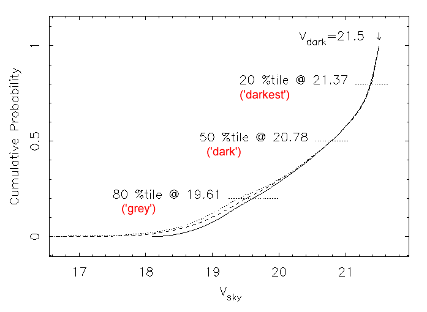

# Sky Background

The optical sky background depends on a number of parameters including the target - moon angular separation, lunar phase, ecliptic latitude, zenith angle, and phase of the solar cycle.

The graph below shows the cumulative probability distributions of V-band sky brightness at an arbitrary phase in the solar cycle for three model observation scenarios. In the first model the target is always at the zenith. The second and third models are more realistic Monte Carlo realisations of likely queue and classical programs. In the second model targets were chosen with a gaussian distribution in Hour Angle with sigma=1 hour, and with a distribution in Declination between -20 and +90 degrees based on the surface area of the celestial sphere. The third model is the same as the second, but with the further constraint that the target must be at least 30 degrees from the moon. It may seem surprising that the results of these 3 models differ so little. This is due to the fact that the primary dependence of night sky brightness is on lunar phase, and secondarily on moon - target distance.

The results of these calculations indicate that the sky at Mauna Kea is fainter than 20.78 mag/arcsec$^2$ for 50% of the time and fainter than 21.37 mag/arcsec$^2$ for 20% of the time for any random target. (For an unbiased distribution of queue-mode nights the moon is below the horizon for about half the time, of course).

Test integral: $\int_{i=1}^n$

Test sum: $\sum_{i=1}^{\infty}$

